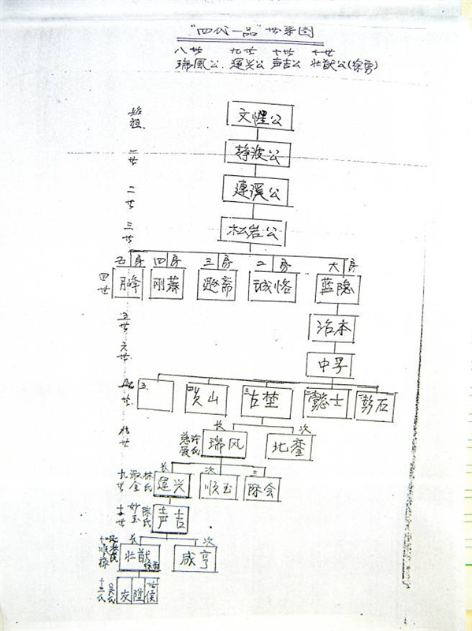

## 徐 Xu

**序言**

未有先知。

**目录**

[TOC]

**正文**

### 一、起源

徐氏入潮始于南宋，潮阳有徐姓人氏，始于南宋庆元年间。

福建漳州府北桥萧洵，字仲川，号启祥，南宋庆元年间（1195）出任潮阳县令。其外甥徐静波随舅萧洵出任潮阳县师爷，四任十二年。开禧三年（1207）任满，舅、甥拟归故里。由于舅、甥在任期间清廉勤政，体恤民情，多行善举，县民感其德而恳切挽留，故二人授民意而定居于潮。潮阳始有萧、徐姓氏。舅、甥二人为报民爱，将县民褒扬萧洵业绩所建生祠改为乡校，并连手致力培育人才，使潮阳学子英才辈出，硕果累累。

时元兵侵潮，静波支持洵公孙衔疾集众抗元，因积劳成疾，于已卯年（1279）卒。静波有四子。次子定居于揭阳，三子定居于海丰，四子皆有文士之风。长子连溪，幼有大志，胸藏韬略，继承先人之志，从戎抗元。时任抗元“指挥使”。与敌激战于赤寮、铜孟等地。后因朝庭抗元兵败，遭元兵追逐。为避元兵诛戮追杀，举家迁隐达濠（现隶属濠江区青篮乡，达濠徐氏由此开始），闭门教授子弟周礼、四书、五经等。次子回福建后迁徙潮州。长子松岩，又名希文，字梦凤。幼聪颖，秉承家训、坚持操守、克承先志、克缵先猷。明正统初赐进士，授广西南宁宣化知事。岁歉，他因赈饥有功，被特授“荣禄大夫”。后转任福州，因不与当政者同流合污，隐退故里。正统十四年五月卒，葬于蛇孔山，即现在濠江区赤隆辖区徐厝埔。

从徐静波来潮迄今共785年，传三十世。裔孙遍布广东汕头、白石、凤鸣、丰顺、梅州、蕉岭、饶平、海丰、陆丰、靖海、增城和福建、港澳台等地区，国外则有美国、加拿大、越南等国家，人口逾十万之众，世代簪缨贤人辈出。

清朝康熙初年，裔孙壮猷随康熙帝出征云南平吴三桂之乱有功，被授“荣禄大夫”功加左都督、湖广总兵，正一品职并诰赠上三代一品。故达濠徐氏有“特授荣禄大夫”功加左都督、湖广总兵，四代一品之美称。明朝进士有：徐天叶、徐日焕、徐庆余、徐志道、徐冽、徐宗敬；举人有：徐义、徐尚卿、徐建新；清朝还有台湾总兵徐奕表、福建和平知事徐悦吾、峨眉县令徐上（平山）、福建诏安典史等。还有曾任中共福州地委书记、牺牲于1927年的革命烈士——徐琛及夫人哲贞。几百年来，各地包括海外子孙无不缅怀先祖，联合海外族亲报效家乡不遗余力！徐氏世代为国家兴旺，潮汕繁荣做出了积极贡献。

### 二、世系

世系图如下：

正文。

### 三、末

正文。 

正文。

### 四、末

正文。 