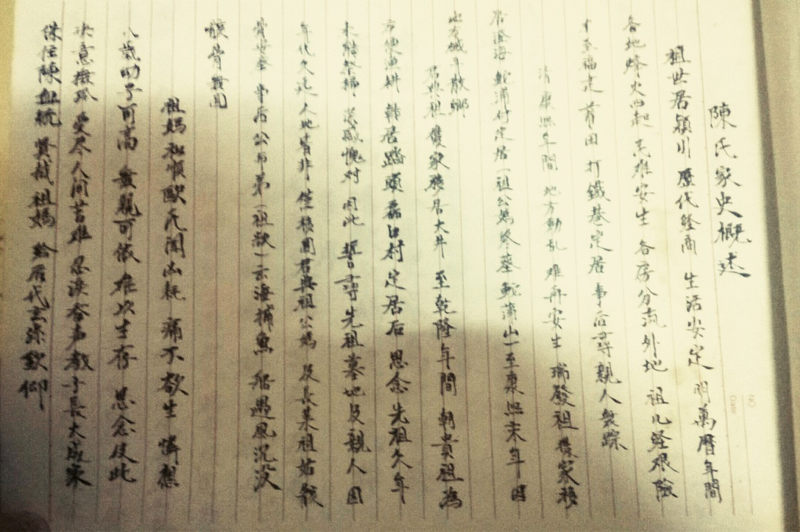
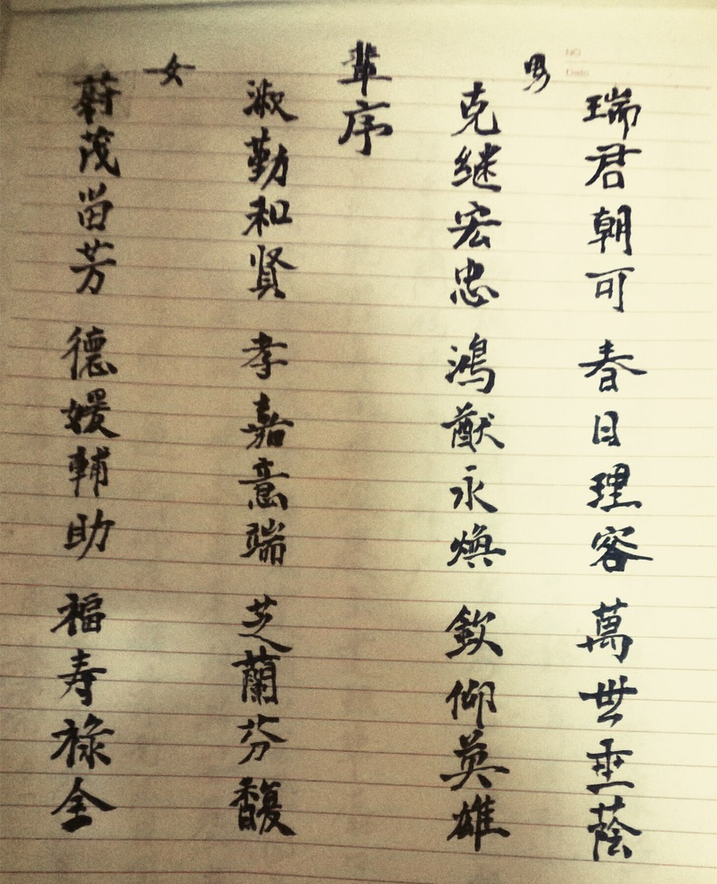

## 陈 Chan

**序言**

拜读《陈氏家史》，原作部分以繁体显，亦作区分。细世间之尘可致，穷未知之心可仰。

**目录**

[TOC]

**正文**

### 一、原作序言

```
敬告：
        關於家史概述及各房先代墳墓名稱輩份等，未能查詳。
        皆因年久，由其各房居住分散及工作關係，聯繫甚難。
        知情難找及人力學識等各種因素限制，只能簡單修整，不達其全而成憾事。
        請多諒解，並希各房另行補全相互聯繫。

    順致謙意。

二〇〇七丁亥歲
```

如手稿图


```
祈书：

	字里行间，可见宽让。

	--Ivan
```

### 二、家史概述

如手稿图



正稿图


正文。

### 三、名字派文

```
# 男名派文
【繁】瑞君朝可，春日理容，萬世垂蔭，克繼宏忠，鴻猷永煥，欽仰英雄
【简】瑞君朝可，春日理容，万世垂荫，克继宏忠，鸿猷永焕，钦仰英雄
```

```
# 女名派文
【繁】淑勤和賢，孝嘉意端，芝蘭芬馥，蔚茂流芳，德媛輔助，福壽祿全
【简】淑勤和贤，孝嘉意端，芝兰芬馥，蔚茂流芳，德媛辅助，福寿禄全
```

如手稿图



### 四、世系血脉

正文。

### 五、文章至末

正文。 